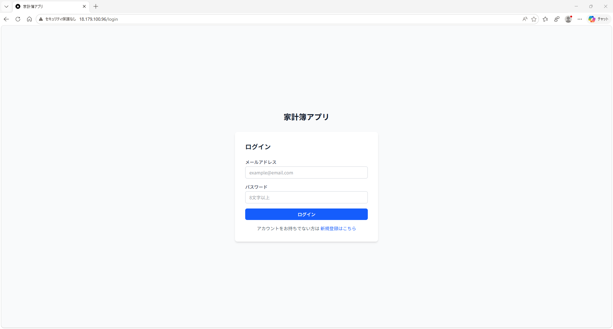
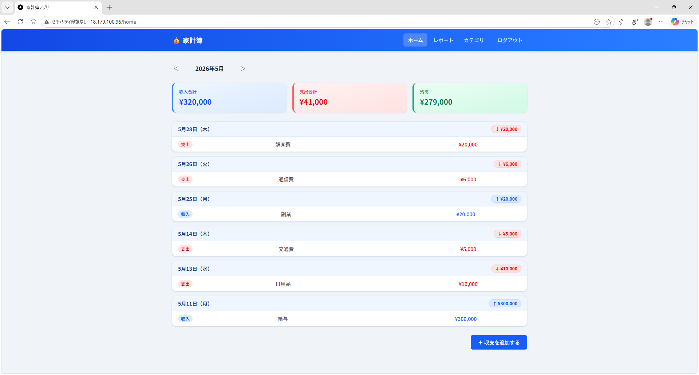
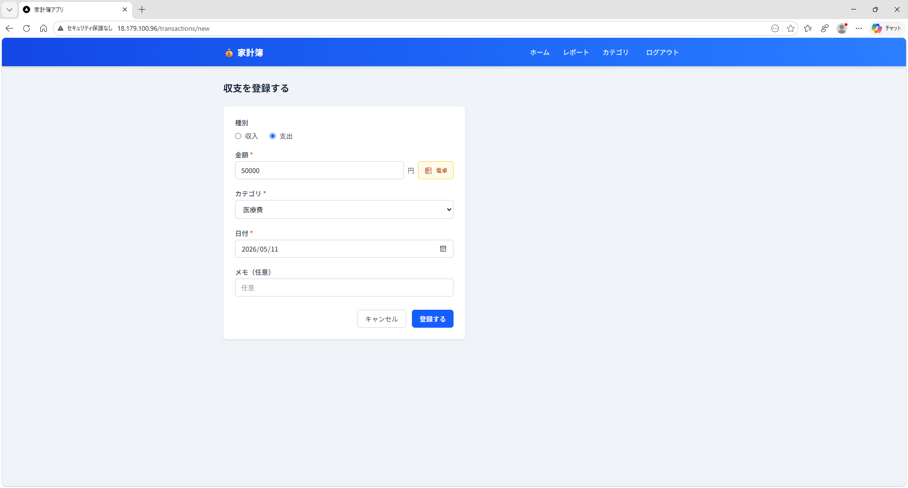
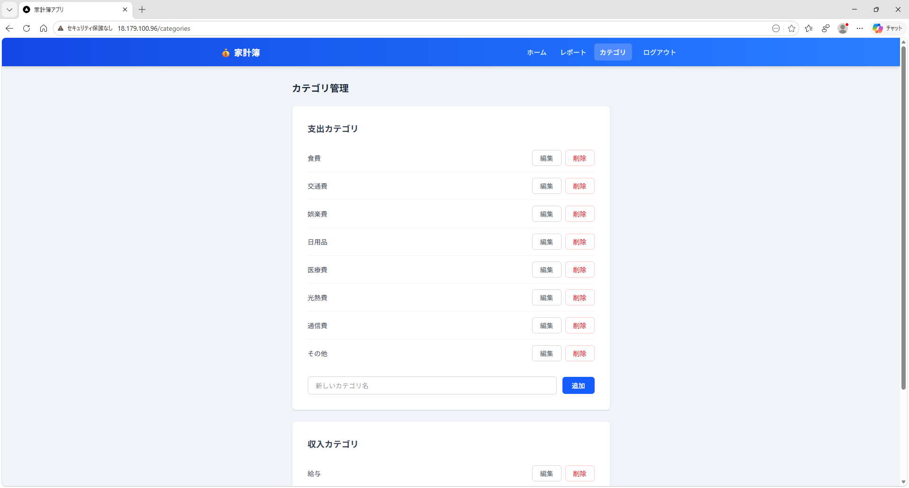
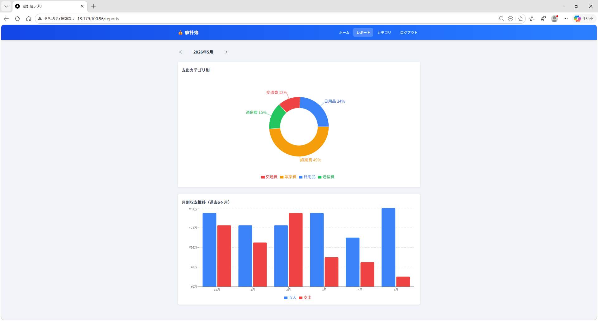

# 家計簿アプリ

個人の収入・支出を記録・管理し、家計の状況を可視化する家計簿Webアプリケーションです。

## スクリーンショット

### ログイン画面


### ホーム画面（収支一覧・カレンダー・月次集計）


### 収支登録（インライン電卓UI）


### カテゴリ管理


### レポート（グラフ）


### 操作デモ

<video src="docs/images/demo.mp4" controls width="800"></video>

## 機能

- **認証**: メールアドレス・パスワードによるユーザー登録・ログイン
- **収支管理**: 収支の登録・編集・削除、月別一覧表示、月次集計（収入合計・支出合計・残高）
- **カレンダー**: 月カレンダーで収支データの有無を確認、日付クリックで絞り込み
- **電卓UI**: 金額入力時にインライン電卓を使用可能（四則演算・%対応）
- **カテゴリ管理**: 収入・支出カテゴリの追加・編集・削除
- **レポート**: 支出カテゴリ別ドーナツグラフ、過去6ヶ月の月別収支棒グラフ

## 技術スタック

| レイヤー | 技術 | バージョン |
|----------|------|-----------|
| フロントエンド | Next.js (React / TypeScript) | Next.js 16.2.6 / React 19 |
| バックエンド | Ruby on Rails（API モード） | Rails 7.1 / Ruby 3.3 |
| データベース | MySQL | 8.0 |
| 認証 | Devise + JWT | — |
| グラフ | Recharts | 3.x |
| インフラ | AWS EC2 + RDS（Terraform 管理） | — |
| コンテナ | Docker / Docker Compose | — |

## 対応環境

- ブラウザ: Google Chrome 最新版
- デバイス: PC のみ（推奨解像度: 横幅 1280px 以上）

## 本番環境（AWS）

| 項目 | 内容 |
|------|------|
| アクセス URL | http://18.179.100.96 |
| フロントエンド | EC2 上の Next.js コンテナ（Port 80） |
| バックエンド API | EC2 上の Rails コンテナ（Port 3000） |
| データベース | RDS MySQL 8.0（EC2 からのみアクセス可） |
| インフラ管理 | Terraform（`terraform/` ディレクトリ） |

### コードを更新したときのデプロイ

```bash
bash scripts/deploy.sh
```

git pull → Docker イメージ再ビルド → db:migrate → ヘルスチェックを自動実行します。

## ディレクトリ構成

```
.
├── backend/                  # Rails API（Ruby 3.3 / Rails 7.1）
│   ├── app/
│   ├── config/
│   ├── Dockerfile            # 本番用イメージ定義
│   └── Gemfile
├── frontend/                 # Next.js（React 19 / TypeScript）
│   ├── src/
│   ├── Dockerfile            # マルチステージビルド
│   └── next.config.ts
├── terraform/                # AWS インフラ定義（Terraform）
│   ├── main.tf               # VPC・EC2・RDS・SG の定義
│   ├── variables.tf
│   ├── terraform.tfvars.example
│   └── bootstrap/            # Terraform 状態管理用 S3/DynamoDB
├── scripts/
│   └── deploy.sh             # 本番デプロイスクリプト
├── docs/                     # 設計ドキュメント
├── docker-compose.yml        # ローカル開発用
├── docker-compose.prod.yml   # 本番用（EC2 上で使用）
└── prototype/                # HTML プロトタイプ
```

## ローカル開発の起動

```bash
# 依存関係のインストールと起動
docker compose up -d

# DB マイグレーション（初回のみ）
docker compose exec api bundle exec rails db:migrate
docker compose exec api bundle exec rails db:seed
```

## プロトタイプの起動

```bash
open prototype/index.html
```

依存関係なし。Chart.js を CDN から読み込んでいます。

## ドキュメント

| ドキュメント | 内容 |
|-------------|------|
| [要件定義書](./docs/requirements.md) | プロジェクト概要・技術選定理由 |
| [ユースケース](./docs/use-cases.md) | ユーザー操作シナリオ |
| [機能要件・非機能要件・エラー仕様](./docs/functional-requirements.md) | 機能一覧・セキュリティ・パフォーマンス要件 |
| [画面設計](./docs/screen-design.md) | 画面一覧・画面遷移図・ワイヤーフレーム |
| [データベース設計](./docs/database-design.md) | テーブル定義・ER 図・制約 |
| [API 設計](./docs/api-design.md) | エンドポイント一覧・リクエスト/レスポンス仕様 |
| [インフラ構成](./docs/infrastructure.md) | AWS アーキテクチャ・Terraform 管理手順 |
| [デプロイ手順](./docs/deployment.md) | 初回セットアップ・更新デプロイ・環境変数一覧 |

